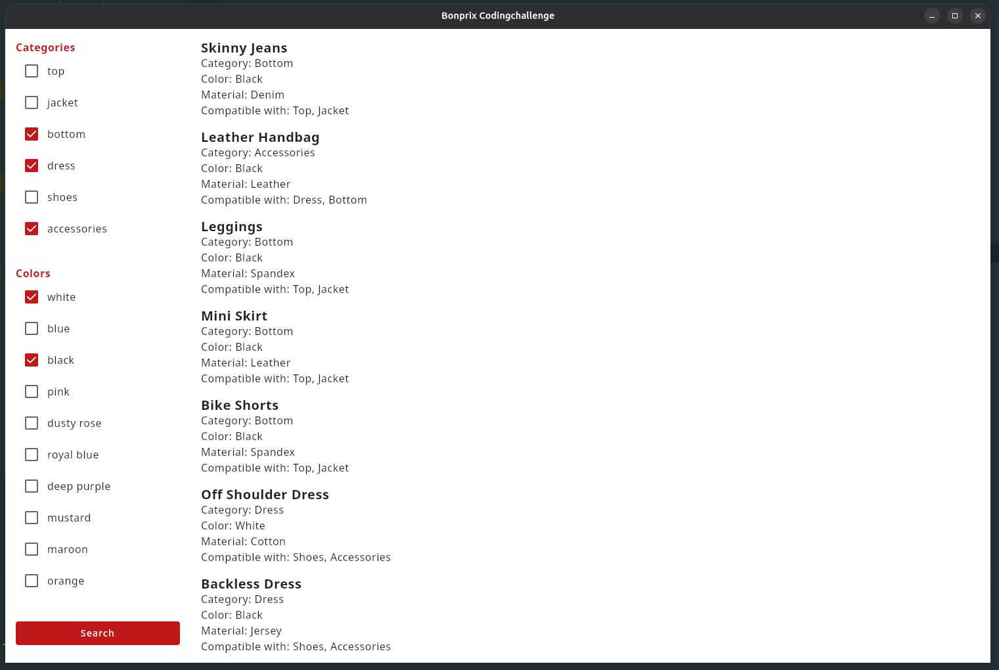

# Bonprix Codingchallenge

This is a Kotlin Multiplatform project to demonstrate wardrobe items with filter options. It contains a library-module with the actual implementation and an app-module with Kotlin Compose.

## Tech-Stack

### Development
- Kotlin
- Ktor-Client
- Kotlinx-Serialization
- Kotlin-Coroutines
- Koin

### Test
- Kotlin-Test
- Strikt

### Buildsystem
- Gradle
